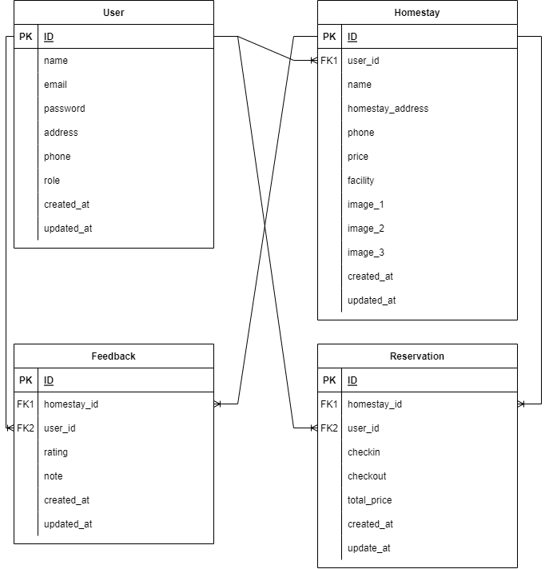
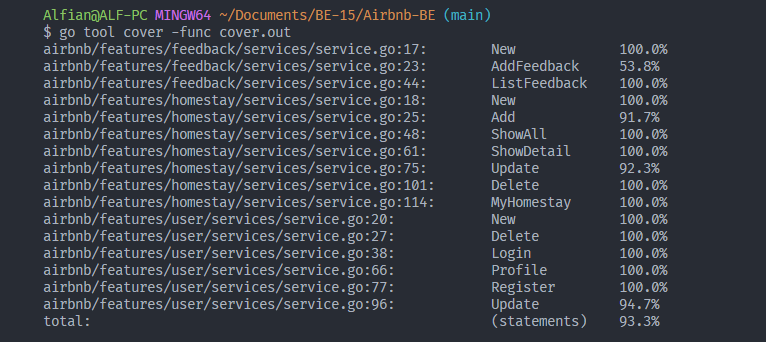

### Build App & Database


# Brain Academy Dashboard

This is a golang rest api project group organized by Alterra Academy. This API is used to run GoHome Airbnb App. This application has features as below.


# Features
## User & Hoster:
- Login
- Register
- Show profile
- Edit profile
- Deactive

<div>

<details>

| Feature User & Hoster | Endpoint | Param | JWT Token | Function |
| --- | --- | --- | --- | --- |
| POST | /login  | - | NO | This is how users log in.  |
| POST | /register | - | NO | This is how user register account. |
| GET | /profile | - | YES | User see their profile data. |
| PUT | /profile | - | YES | This is how users update their profile and change their role. |
| DELETE | /profile | - | YES | This is how Delete account. |

</details>

<div>

## Homestay :
- Add homestay
- Show all homestay
- Show detail homestay
- Show list for user homestay list
- Update homestay
- Delete homestay

<div>

<details>

| Feature Homestay | Endpoint | Param | JWT Token | Function |
| --- | --- | --- | --- | --- |
| POST | /homestays | - | YES | This is how hoster add homestays. |
| GET | /homestays  | - | YES | This is how all homestays show in app.  |
| GET | /homestays/ID  | ID| YES | This is show detail homestay.  |
| GET | /myhomestays  | - | YES | This is how all homestay list from hoster.  |
| PUT | /homestays/ID  | ID | YES | This is how hoster edit homestay.  |
| DELETE | /homestays/ID  | ID | YES | This is how all hoster delete their homestay.  |

</details>

</div>

## Reservation :
- Check reservation
- Add reservation
- Show all reservation

<div>

<details>

| Feature Reservation | Endpoint | Param | JWT Token | Function |
| --- | --- | --- | --- | --- |
| POST | /reservations/check | - | YES | This is how user check reservations. |
| POST | /reservations  | - | YES | This is how add reservations show in app.  |
| GET | /reservations | - | YES | This is show history reservation.  |

</details>

</div>

## Feedback :
- Add feedback
- Show list feedbacks in homestay

<div>

<details>

| Feature Feedback | Endpoint | Param | JWT Token | Function |
| --- | --- | --- | --- | --- |
| POST | /feedbacks | - | YES | This is how user add feedbacks. |
| GET | /homestay/ID/feedbacks | ID | YES | This is how user feedbacks in homestay detail page. |

</details>

</div>


# ERD


# API Documentations

[Click here](https://app.swaggerhub.com/apis-docs/ALFIANADSAPUTRA_1/AirBnB/1.0.0) to see documentations.


## How to Install To Your Local

- Clone it

```
$ git clone https://github.com/ALTA-KEL3/Airbnb-BE.git
```

- Go to directory

```
$ cd Airbnb-BE
```


# UNIT TEST COVERAGE ALL


## Authors 👑

-   Ida Kusumawati [](https://github.com/kocwng)

-  Alfian Aditya [](https://github.com/alfianadityads)

 <p align="right">(<a href="#top">back to top</a>)</p>
<h3>
<p align="center">:copyright: March 2023 </p>
</h3>
<!-- end -->
<!-- comment -->